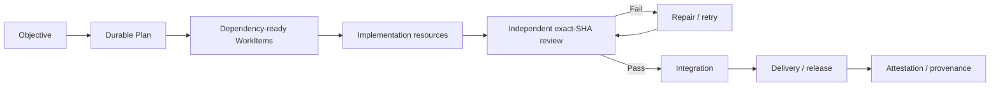

# ForgeFlow

> **Autonomous software engineering with durable plans, isolated execution, independent review, recovery, and exact-revision release evidence.**

<p align="left">
  <a href="https://github.com/BakerSean168/forgeflow/releases/tag/v1.1.1"><strong>v1.1.1</strong></a> ·
  <a href="./docs/getting-started.md"><strong>Getting Started</strong></a> ·
  <a href="./docs/platform-architecture-north-star.md"><strong>Platform Architecture</strong></a> ·
  <a href="./docs/architecture.md"><strong>Runtime Invariants</strong></a> ·
  <a href="./docs/api.md"><strong>API</strong></a> ·
  <a href="./docs/extensibility.md"><strong>Extensibility</strong></a> ·
  <a href="./CREDITS.md"><strong>Credits</strong></a>
</p>

<p align="left">
  
  
  
</p>

Give ForgeFlow a software-engineering objective. It turns that objective into durable work, executes dependency-ready tasks through governed coding-agent resources, independently reviews exact revisions, repairs failures, integrates accepted changes, and closes the lifecycle with repository and release evidence.

ForgeFlow is not a single coding agent and it does not treat an agent saying “done” as completion. **The model proposes work; ForgeFlow owns the lifecycle.**

## Why ForgeFlow?

A conventional autonomous coding loop can collapse planning, implementation, verification, and acceptance into one mutable session:

```text
Prompt -> Agent -> edits files -> "done"
```

ForgeFlow separates those responsibilities and makes them durable:

```text
Objective
   |
   v
Durable Plan / dependency graph
   |
   +---- dependency-ready WorkItems ----+
   |                                     |
   v                                     v
Implementation A                    Implementation B
   | exact commit                       | exact commit
   v                                     v
Independent exact-SHA review       Independent exact-SHA review
   |                                     |
   +---------- repair / retry -----------+
                     |
                     v
              Serial integration
                     |
                     v
        Provider cleanup + worktree retirement
                     |
                     v
            Delivery / release evidence
```

This makes long-running development recoverable across model failures, provider outages, process restarts, review failures, and interrupted execution without giving a model authority over the controller's safety state.

## Engineering highlights

| Concern | ForgeFlow approach |
| --- | --- |
| Long-running development | durable Plan / WorkItem / Execution / Review state |
| Project concurrency | one active root Plan per project + FIFO queue |
| Parallel implementation | dependency-aware, explicitly non-conflicting waves |
| Repository isolation | literal Git worktrees with controller-owned provenance |
| Writer safety | one mutable writer per worktree, fenced handoff |
| Review | independent review pinned to the exact candidate SHA |
| Recovery | immutable retry/fallback lineage + restart-safe reconciliation |
| Provider routing | governed resource directory with runtime admission |
| Progress | provider/tool activity is distinct from meaningful workspace progress |
| Cleanup | terminal provider cleanup proof before retirement/lease release |
| Release | exact source SHA + artifact digest + release-bound acceptance |
| Improvement | typed, bounded diagnosis feeding ordinary Plans rather than privileged mutation |
| Self-change | separate canary and promotion gates; disabled by default |

## Engineering loop



Implementation and review are separate lifecycle phases. A successful provider process is not sufficient: ForgeFlow validates Git linkage, changed-file scope, clean committed state, review provenance, provider cleanup, worktree retirement, lease/head state, and release identity before acceptance.

## Execution ecosystem

ForgeFlow deliberately separates the **control plane** from the **execution plane**.

```text
                         ForgeFlow
                durable lifecycle authority
                           |
          +----------------+----------------+
          |                                 |
          v                                 v
      OpenHands                      Provider-native workers
   execution plane                     (e.g. Antigravity)
          |
   ACP/headless agents
   Codex / Claude / OpenCode /
   DSH / ZCode / ...
          |
          v
        LiteLLM / provider APIs
```

### OpenHands relationship

ForgeFlow uses the [OpenHands Software Agent SDK](https://github.com/OpenHands/software-agent-sdk) as a version-pinned Agent Server execution plane. The checked-in deployment currently pins `v1.39.1` and verifies the exact upstream commit before building the image.

OpenHands owns that agent-server/runtime layer. ForgeFlow independently owns durable planning, worktree/writer authority, resource selection, independent review lineage, recovery, integration, cleanup barriers, and release attestation. ForgeFlow is an independent project and is not an OpenHands fork or rebrand.

See [`CREDITS.md`](./CREDITS.md) and [`THIRD_PARTY_NOTICES.md`](./THIRD_PARTY_NOTICES.md) for attribution and third-party licensing information.

## V1 safety model

- **Durable before conversational** — the database, not chat history, is the source of truth.
- **Single-writer safety** — one mutable writer owns a worktree at a time.
- **Exact-revision review** — review is detached from implementation and bound to an immutable Git revision.
- **Evidence over claims** — provider success, reasoning, or tool churn does not replace controller verification.
- **Fail-closed recovery** — unknown repository identity, writer ownership, cleanup, or provenance drift blocks handoff rather than being silently repaired.
- **Bounded intelligence** — Supervisor/diagnosis models may propose typed actions; deterministic controller code owns privileged state transitions.
- **Hard-gated self-change** — self-change, canary, promotion, and autonomous promotion are separate controls and default off.

For the detailed state machine, literal-worktree ACL/provenance model, retry semantics, provider cleanup barrier, and release acceptance contract, read [`docs/architecture.md`](./docs/architecture.md).

## Repository layout

```text
src/
  api/                 versioned Fastify API modules + OpenAPI surface
  platform/            project registry and platform extension foundations
  app.ts               composition root + legacy V1 route migration surface
  main.ts              production entrypoint
  core/
    domain/            plans, executions, reviews, resources, worktrees
    kernel/            deterministic state-changing operations
    orchestration/     execution/review/repair/delivery progression
    supervisor/        bounded AI observation and typed decisions
    adapters/          Git, OpenHands, providers, delivery and telemetry
    persistence/       SQLite schema, repositories and event store

api/
  openapi.v1.json      deterministic external API contract
deploy/
  projects.example.yaml declarative project-registry example
  gcp/                 hardened systemd deployment
  openhands/           isolated OpenHands execution plane
openhands_tools/       execution/review ACP and headless adapters
scripts/               release, probes, acceptance and maintenance
test/                  lifecycle, adapter, recovery and deployment contracts
```

## Quick start

Requirements: Node.js 24+ and npm 10+.

```bash
git clone https://github.com/BakerSean168/forgeflow.git
cd forgeflow
npm ci
npm run check
```

Start the local control plane:

```bash
npm run dev
```

The repository is intentionally fail-closed: checked-in examples contain no enabled projects or credentials. Full provider/repository execution requires explicit operator configuration.

Continue with:

- [`docs/getting-started.md`](./docs/getting-started.md) — first local run and real-provider acceptance.
- [`docs/configuration.md`](./docs/configuration.md) — project authorization, resources, OpenHands, provider-native workers and secrets.
- [`docs/api.md`](./docs/api.md) — stable HTTP boundary and OpenAPI contract.
- [`docs/extensibility.md`](./docs/extensibility.md) — Project Registry, feature modules, extension points and migration rules.
- [`docs/development.md`](./docs/development.md) — development and contribution workflow.
- [`docs/platform-architecture-north-star.md`](./docs/platform-architecture-north-star.md) — north-star platform architecture and open-source patterns adopted into ForgeFlow.
- [`docs/platform-refactor-v2.md`](./docs/platform-refactor-v2.md) — phased internal restructuring plan and verification gates.
- [`docs/architecture.md`](./docs/architecture.md) — detailed runtime and safety invariants.

## Verification

```bash
npm run check
```

The deterministic gate runs product- and architecture-boundary validation, type checking, OpenAPI drift detection, the full test suite, and a clean production build.

Real-provider acceptance is intentionally separate:

```bash
npm run smoke:autonomous-lifecycle
```

It creates real autonomous lifecycle state and may consume provider resources. Release acceptance is bound to the exact running source SHA and artifact digest; an older attestation cannot make a newer release healthy.

## Deployment safety

The hardened Linux/GCP deployment uses explicit project allowlists, host-managed credentials, isolated execution identities, and a fail-closed installer. Default locations are:

- control plane: `127.0.0.1:8420`
- OpenHands Agent Server: `127.0.0.1:18420`
- durable state: `/var/lib/forgeflow`
- configuration: `/etc/forgeflow`
- API: `/api/v1/*`
- approved release ref: `refs/forgeflow/release-approved`

Do not copy production credentials into the repository. See [`SECURITY.md`](./SECURITY.md).

## License

ForgeFlow is open source under the [MIT License](./LICENSE).

Third-party software keeps its own license. OpenHands attribution and the pinned upstream MIT notice are documented in [`THIRD_PARTY_NOTICES.md`](./THIRD_PARTY_NOTICES.md); broader ecosystem acknowledgements are in [`CREDITS.md`](./CREDITS.md).
